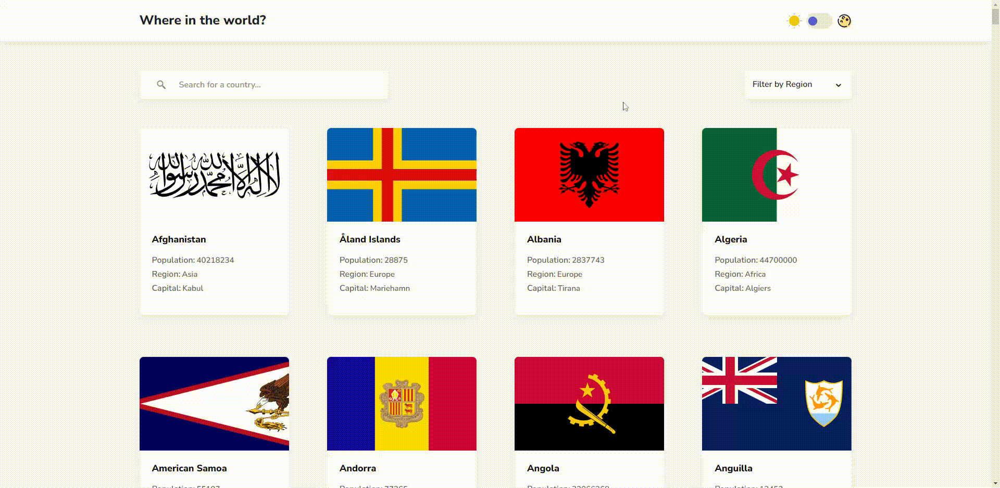

# RestCountries

## Demo 💻 

 
## hosted website 

website: <a ahref="https://rest-countries-six-beta.vercel.app/" target="_blank">https://rest-countries-six-beta.vercel.app/</a>

## 📔 About the Project

RestCountries is an innovative project that uses an API to collect comprehensive information about different countries. With features ranging from capital and name to population and more, RestCountries gives users quick and easy access to essential data from nations around the world.

### 🛠 Technologies

<ul>
   <li>
      <a href="https://react.dev/" target="_blank">React.js</a>
   </li>
    <li>
      <a href="https://www.typescriptlang.org/" target="_blank">Typescript</a>
   </li> 
    <li>
      <a href="https://reactrouter.com/en/main" target="_blank">React Router</a>
   </li>    
   <li>
      <a href="https://chakra-ui.com/getting-started" target="_blank">Chakra UI</a>
   </li>    
      <li>
      <a href="https://axios-http.com/ptbr/docs/api_intro" target="_blank">axios</a>
   </li>    
      </li>    
      <li>
      <a href="https://swr.vercel.app/pt-BR" target="_blank">SWR</a>
   </li>    
</ul>

## 💻 How to run the application

You must have the tools installed: <a href="https://git-scm.com/" target="_blank">Git</a>, <a href="https://nodejs.org/en" target="_blank">Node.js.</a>

<pre>
   # In the terminal, clone the project:
   $ git clone https://github.com/Otavin23/REST-Countries.git
   
   # Enter in folder
   $ cd REST-Countries

   # Install dependecias
   $ npm install

   # Starting Project 
   $ npm run dev   

</pre>

Projeto iniciando em <a href="">localhost:5173</a>
